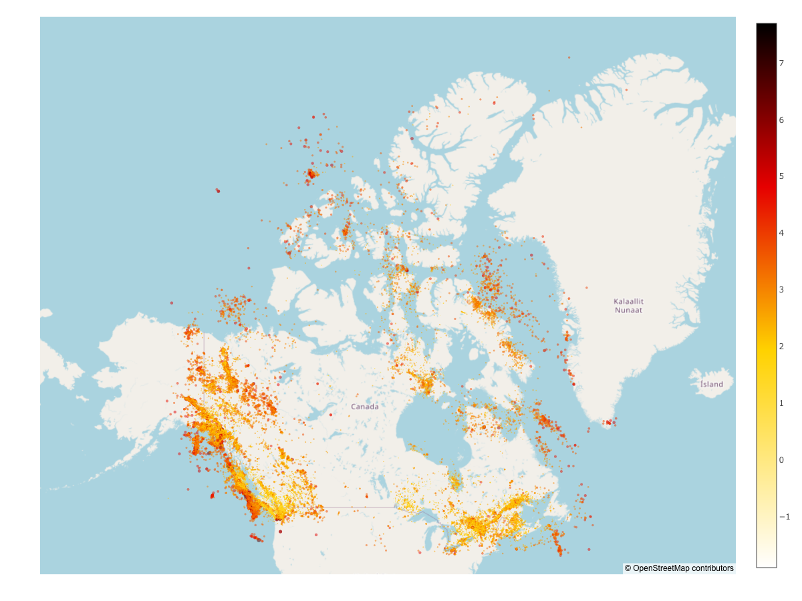
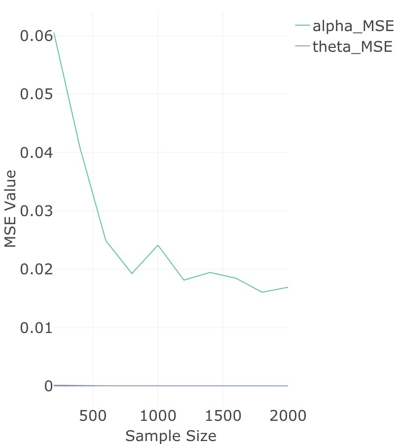
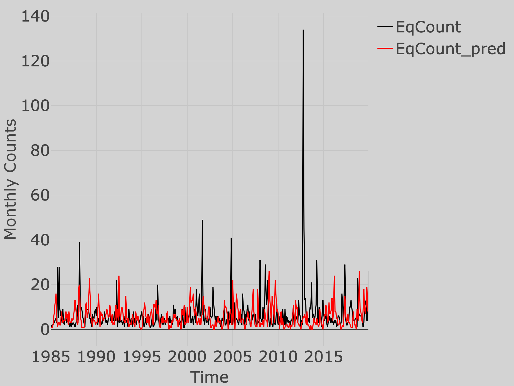

```{r setup, include=FALSE}
knitr::opts_chunk$set(echo = FALSE, warning = FALSE)
library(plotly)
library(tidyverse)
library(htmlwidgets)
library(webshot)
library(zoo)
library(tseries)
library(kableExtra)
source("CodeSpace.R")

axisfont<-list(size=30)
mars<-list(l=0, r=0, b=0, t=20)
```

# Introduction
Earthquakes are usually caused when the underground rock suddenly breaks and there is rapid motion along a fault. They can be categorized into natural earthquakes and artificial earthquakes. Natural earthquakes can be further classified into tectonic earthquakes and volcanic earthquakes. Tectonic earthquakes are caused by the rupture of rocks deep in the ground and the rapid release of energy accumulated over a long period of time. Volcanic earthquakes are caused by volcanic eruptions. In addition, artificial earthquakes are caused by human activities that alter the stresses and strains on Earth's crust. In our project we will only focus on the natural earthquake due to its probabilistic nature of occurrence.

Earthquakes are difficult to predict for three main reasons. Firstly, plate boundaries are prone to earthquakes, but the way and speed of plate movement is difficult to measure and predict accurately. Secondly, the low frequency of large earthquakes does not provide enough data for earthquake modeling. Thirdly, it is difficult to enter the inner crust of the earth to observe the data, so most of the detection of earthquakes is done by collecting some vibrations and signals on the surface to analyze and predict them, which leads to a decrease in the accuracy of earthquake prediction.

Frequent historical earthquakes give us a huge data set that can be used to study earthquake causes, correlations, space-time, and further earthquake prediction. Current researches have provided several statistical models to analyze the earthquake processes. Trigger model, a special case of the Neyman-Scott clustering model, can be used to estimate aftershocks after a major earthquake [@Cite1]. Epidemic-Type Aftershocks Sequence (ETAS) model is also widely used to forecast earthquake occurrences [@Cite2]. In addition, time series analysis can be done to explore cycles related to earthquake frequency and it is also effective in predicting large earthquakes [@Cite3]. There are also several techniques from machine learning that provide us alternative ways other than conventional statistical models to analyze the earthquake data. For example, deep learning can be used to predict seismic events, including intensity and location [@Cite4]. Clustering model can identify regions with high-frequency earthquakes to upgrade building structures to reduce damage from impending earthquakes.

We focus on a data set of earthquake occurrence in Canada provided by the Government of Canada. The data set is located at https://open.canada.ca/data/en/dataset/4cedd37e-0023-41fe-8eff-bea45385e469. In this project we want to analyze the data to give a detailed review of this natural disaster in the country and make some inference about its characteristics. In particular, we want to check if there's any location-wise pattern in earthquake occurrence and how frequent it can happen. Then we want to analyze if the occurrence of earthquake is also correlated to some other variables such as seasonality. Finally we want to apply some probabilistic model that have been extensively studies by other researchers to the data in order to assess the counts of future occurrence.

# Method
First, we will demonstrate some aspects of the earthquake occurrence by visualizing the seismic data. Map charts and other related plots will be used to perform such initial analysis. Then we will use time series analysis to study whether there exist temporal trends, seasonal patterns, and certain frequency in seismic events. Lastly, we will try to estimate the monthly counts of earthquakes with a new model called INARPQX(1) that has been recently published.

```{r, echo=FALSE}
eqarchive <- read.csv("eqarchive-en.csv", header = TRUE)
```

From the following glossary we have found the definitons of our data variables: (https://earthquakescanada.nrcan.gc.ca/info-gen/glossa-en.php)

- Latitude: The location of a point north or south of the equator. Latitude is shown on a map or globe as east-west lines parallel to the equator.  

- Longitude: The location of a point east or west of the prime meridian. Longitude is shown on a map or globe as north-south lines left and right of the prime meridian, which passes through Greenwich, England.  

- Depth: The value given is the depth below the surface of the mean spheroid.  

- Magnitude: Magnitude is a measure of the amount of energy released during an earthquake. It may be expressed using the Richter scale.  

We gathered all relevant information into a formal data definition:

```{r, echo=FALSE}
DataDict<-data.frame(
  Variables=colnames(eqarchive), 
  Example=sapply(eqarchive, function(x) paste(as.character(head(unique(x),1)), collapse = ", ")),
  Number.Unique=sapply(eqarchive, function(x) length(unique(x))),
  PctMissing=sapply(eqarchive, function(x) paste0(round(sum(is.na(x))/length(x), 4)*100,"%" ) ),
  Comment=c("The exactly time that earthquakes occur.",
             "The location of a point north or south of the equator.Latitude is shown on a map or globe as east-west lines parallel to the equator.",
             "The location of a point east or west of the prime meridian.Longitude is shown on a map or globe as north-south lines left and right of the prime meridian, which passes through Greenwich, England.",
             "The value given is the depth below the surface of the mean spheroid. It shows the point of initial rupture within Earth",
             "Magnitude is a measure of the amount of energy released during an earthquake.",
             "Distinct magnitude scales base on the type of the earthquakes and the differences of data collection.",
             "The locations where earthquakes happened.",
             "continued for place",
             "continued for place"
  )
)
DataDict%>%remove_rownames() %>%
  kable(booktabs = TRUE, caption = "Data Dictionary") %>%
  kable_styling(font_size = 11, latex_options = c("striped", "scale_down", "hold_position")) %>%
  column_spec(3, width = "40em") %>%
  row_spec(0, bold = TRUE)
```


Note that all values in "date" are specified in UTC (Coordinated Universal Time) and of the form: YYYY-MM-DDTHH:MM:SS+ssss, where the prefix before T refers to the date, the suffix after T refers to the specified UTC time and ssss means the sub-seconds expressed between 1/10 of a second to microsecond resolution.  

By exploring variables "magnitude.type", we found out the earthquakes were recorded in different magnitude scales. 

```{r, echo=FALSE}
cat("*Group by magnitude type:\n")
table(eqarchive$magnitude.type)
```

1. $M_{L}$ means local magnitude, which is the magnitude defined by Charles Richter for California. However, due to the different attenuation methods of seismic waves in Eastern North America, Otto Nuttli defined a magnitude formula more suitable for Eastern North America, called Magnitude Nuttli, which is $m_{N}$. There exists some other scales of magnitude, but the magnitude of the moment scale ($M_{W}$ or $M$) is the most common way to describe earthquakes. (https://earthquakescanada.nrcan.gc.ca/info-gen/faq-en.php#ml_and_mn)

The main benefit of $M_W$ is that the magnitude is directly tied to earthquake source processes that do not saturate. Body wave magnitudes ($m_{b}$) and surface magnitudes ($M_{s}$) do not correctly reflect the size of large earthquakes due to saturating at large magnitudes.

2. Negative magnitude is not an error, because magnitude calculations are based on a logarithmic scale. 10 times drop in amplitude decreases the magnitude by 1. Hence magnitude -1 is 10 time less than magnitude 0. Negative magnitude represents small earthquake which are not felt by human. (https://earthquakescanada.nrcan.gc.ca/info-gen/faq-en.php#ml_and_mn)

# Exploratory Analysis

```{r, eval=FALSE}
fig <- eqarchive%>%plot_ly( 
  lat = ~latitude,
  lon = ~longitude,
  marker = list(color = ~magnitude, colorscale = 'Hot', opacity=0.5, size=~magnitude, showscale=TRUE, reversescale=TRUE),
  type = 'scattermapbox', mode="markers",text = ~paste("Magnitude: ", magnitude)) %>%
  layout(
    mapbox = list(
      style = 'open-street-map',
      zoom =2.5,
      center = list(lon = -88, lat = 34))) 
```

```{r, echo=FALSE, fig.align='center', fig.cap = "Earthquake Location in Canada"}

```

We have plotted the locations of earthquakes on the map, and it is evident that there is a substantial amount of data. Earthquakes primarily occur in regions of Canada that are in proximity to the United States and Greenland.
British Columbia, New Brunswick, and Yukon experience earthquakes more frequently than other provinces. British Columbia and Yukon are located on the Pacific Plate boundary, where the Pacific Plate is subducting beneath the North American Plate. This subduction can lead to significant seismic activity. New Brunswick is near the St. Lawrence rift system, which is also associated with fault lines and seismic activity.

```{r}
eqarchive%>%mutate(date=as.POSIXct(date, format = "%Y-%m-%d"))%>%ggplot(aes(x = date, y = magnitude)) +
  geom_point() +
  labs(x = "Date", y = "Magnitude") +
  ggtitle("Earthquake Magnitude Over Time") +
  theme_minimal()
```

The magnitude of earthquakes is usually divided into seven main categories, which, depending on the magnitude, we can describe as follows:

1. "Microearthquake": Magnitude less than or equal to 1. These are tiny earthquakes that are usually hard to detect.
2. "Minor Earthquake" or "Microseismic": the magnitude is greater than 1 and less than or equal to 3. This type of earthquake is usually not easy to be perceived, especially when the epicenter is deeper.
3. "Felt Earthquake": Magnitude greater than 3, less than or equal to 4.5. People can feel this kind of earthquake, but it usually does not cause damage.
4. "Moderate Earthquake": The magnitude of the earthquake is greater than 4.5, less than or equal to 6. This type of earthquake is potentially destructive, but the extent of damage depends on a number of factors, such as the depth of the epicenter and the distance from the epicenter.
5. "Strong Earthquake": Magnitude greater than 6, less than or equal to 7. This type of earthquake is more destructive.
6. "Major Earthquake": The magnitude is greater than 7 and less than or equal to 8. This type of earthquake may cause surface rupture and widespread seismic wave propagation.
7. "Massive Earthquake": The magnitude is greater than 8 or higher. Such earthquakes usually result in significant crustal displacement and seismic wave propagation, posing a significant threat to the surrounding area.

We calculated the number of earthquakes occurring in each of these seven different earthquake magnitude categories separately. We found that between 1985 and 2019, "Moderate Earthquake" occurred 828 times ; "Strong Earthquake" had 36 recorded occurrences; "Major Earthquake" occurred only three times, and "Massive Earthquake" never occurred during this 35-year period. The cumulative number of earthquakes in these categories shows a significant difference compared to the other three categories. This suggests that most earthquakes occurred in these decades did not cause much damage to people, buildings, or the ground.

```{r}
#Dividing the magnitude into 7 levels 
breaks <- c(-Inf, 1, 3, 4.5, 6, 7, 8, Inf)
categories <- cut(eqarchive$magnitude, breaks = breaks)
magnitude_level <- table(categories)
magnitude_level_df <- data.frame(
  Magnitude_Range = as.character(names(magnitude_level)),
  Earthquake_Count = as.numeric(magnitude_level)
)
print(magnitude_level_df)
```

In order to compare the relative proportions of the number of earthquakes occurring in each earthquake magnitude category corresponding to the overall number of earthquakes more visually, we plotted the pie chart. As can be seen, 73% earthquake's magnitude $M \in (1, 3]$, which was "Minor Earthquake". This was the highest ratio for these seven earthquake magnitude categories and it accounted for almost three quarters of the total earthquakes happened between 1985 and 2019 year. The proportion of earthquakes whose magnitude $M \in (3, 4.5]$ was a little greater than the earthquakes whose magnitude $M \in (-\infty, 1]$. These two types of earthquakes accounted for 25% of the total and the remaining four categories of large earthquakes accounted for less than 1% of the total. Although these earthquakes were the most destructive, most earthquakes occurred in these decades did not cause much damage to people, buildings, or the ground.

```{r}
#Calculating the percentages for different earthquake magnitude's levels
percentages <- (magnitude_level_df$Earthquake_Count / sum(magnitude_level_df$Earthquake_Count))*100
A <- as.data.frame(percentages)

#Draw the pie chart of the percentage
piechart <- plot_ly(A, labels=~magnitude_level_df$Magnitude_Range, values=~percentages, type="pie", width = 500, height = 400)%>% 
  layout(margin=list(l=0, r=0, b=0, t=20),
         title = list(text="Pie Chart of Magnitude levels", font=list(size=10)),
         xaxis = list(showgrid = FALSE, zeroline = FALSE, showticklabels = FALSE),
         yaxis = list(showgrid = FALSE, zeroline = FALSE, showticklabels = FALSE),
         legend = list(title = list(text="Magnitude levels"),font=list(size=10))
  )
piechart
```

We have separately calculated the number of earthquakes with a magnitude $M \in [4.5, \infty)$ that occurred each year and plotted a time series graph. From 1985 to 1999, there was a slow decrease followed by an increase in the number of earthquakes. However, the annual earthquake count remained around 1500 on average and did not exceed 2000. Starting from the year 2000, we observed a significant upward trend in the occurrence of earthquakes with a magnitude of 4.5 or higher, reaching its peak in 2010 with 5409 events. From 2011 to 2019, although there were noticeable fluctuations in the annual earthquake count, it consistently remained above 3000 and did not drop below 3253, indicating a relatively high frequency.

Based on this, we can infer that from 1985 to 2019, the number of earthquakes with a magnitude of 4.5 or higher increased with the passage of years, particularly during the ten-year period from 2000 to 2010, when the growth rate was particularly pronounced.

```{r}
selected_eq_data <- eqarchive[eqarchive$magnitude >= 4.5, ]

frequency <- eqarchive %>%
  group_by(year = year(date)) %>%
  summarise(count = n())
frequency$year <- as.numeric(frequency$year)

x <- ts(frequency)

plot_ly(data = frequency, x = ~year, y = ~count, type = "scatter", mode = "lines", name = "Number of Earthquakes with Magnitude 4.5 or Above Occurred from 1985 to 2019") %>%
  layout(title = "Number of Earthquakes with Magnitude 4.5 or Above",
         xaxis = list(title = "Year"),
         yaxis = list(title = "Number of Earthquakes")
  )
```

To assess the forecasting accuracy of the ARIMA model for earthquake events, we processed the original data into a monthly data from 1985 January to 2019 December. Subsequently, we computed the count of earthquakes with a magnitude greater than 4 for each month and year, resulting in a corresponding time series and we utilized the data from the first 32 years as the training set, reserving the data from the subsequent 3 years as the testing set.

Figure() illustrated this time series, and upon observation, it was evident that, with the exception of a few months characterized by a higher frequency of earthquakes exceeding magnitude 4, the curve generally fluctuated around a relatively constant level. The amplitude of these fluctuations was minimal, suggesting stationarity in the time series.

```{r}
eq_data1 <- eqarchive %>%
  select(date, magnitude) %>%
  filter(magnitude >= 4) %>%
  mutate(year_month = as.yearmon(date))

summary_data <- eq_data1 %>%
  group_by(year_month) %>%
  summarize(row_count = n())

summary_data$year_month <- as.Date(as.yearmon(summary_data$year_month))

all_months <- seq(as.Date("1985-01-01"), as.Date("2019-12-01"), by = "months")
all_months_data <- data.frame(year_month = as.Date(as.yearmon(all_months)))

summary_data <- all_months_data %>%
  left_join(summary_data, by = "year_month") %>%
  replace_na(list(row_count = 0))

eq_ts_all <- ts(summary_data$row_count, frequency = 12, start = c(1985,1))
eq_ts <- window(eq_ts_all, start=c(1985,1), end=c(2016,12))
eq_ts_test <- window(eq_ts_all, start=c(2017,1), end=c(2019,12)) 

plot(eq_ts)
```

Next, we conducted a decomposition analysis on this time series. Figure() displayed, from top to bottom, the original time series plot, trend plot, seasonal plot, and residual plot. From the graphs, we observed that the fluctuation in the occurrence of earthquake with a magnitude exceeding 4 was not pronounced, maintaining a relatively stable state, except for a few sudden increases.

By subtracting the seasonal component from the original time series, we obtained a seasonally adjusted time series. The results are depicted in Figure(): the black curve represented the original time series, while the red curve represented the time series after removing the seasonal component. The small difference between the two curves indicated that the influence of seasonal variations on the frequency of seismic events with a magnitude exceeding 4 was minimal.

```{r}
decomposed_eq <- decompose(eq_ts, type="additive")
plot(decomposed_eq)

m_t <- decomposed_eq$trend #get the trend
s_t<- decomposed_eq$seasonal #get the seasonality
e_t<- decomposed_eq$random # get the random component

adjusted_eq <- eq_ts-decomposed_eq$seasonal
plot(adjusted_eq)
lines(eq_ts, col=2)
```


To validate our hypothesis about the lack of pronounced seasonal and trend changes, we applied a linear regression model to fit the data separately.

In the summary we saw that the p-value of the hypothesis test was 0.06847, bigger than 0.05, which meant we could not reject the null hypothesis $H_0:\beta_1=0$. The same as the seasonal changes, because the p-value was equal to 0.06518, so we could not reject the null hypothesis $H_0:\beta_1=0$. Therefore we could assume that all these three components were insignificant in the time series.

```{r}
z_t<-(eq_ts-s_t) #remove the seasonality first to fit the trend
z_t<-data.frame(Index=index(z_t), Zt=c(z_t))
Regression<-lm(Zt~Index, data=z_t) #fitting a simple linear regression model w.r.t time
slope<-Regression$coefficients[["Index"]] #the parameter of the linear model
intercept<-Regression$coefficients[["(Intercept)"]] #the intercept of the linear model
summary(Regression)

z_t1<-(eq_ts) #remove the seasonality first to fit the trend
z_t1<-data.frame(Index=index(z_t1), Zt1=c(z_t1))
Regression<-lm(Zt1~Index, data=z_t1) #fitting a simple linear regression model w.r.t time
slope<-Regression$coefficients[["Index"]] #the parameter of the linear model
intercept<-Regression$coefficients[["(Intercept)"]] #the intercept of the linear model
summary(Regression)
```

Before establishing an appropriate model, it was essential to conduct a stationarity test on the time series data. We posit the null hypothesis as a non-stationary time series, with the alternative hypothesis being 'stationary.' The results of the Augmented Dickey-Fuller (ADF) test yielded a p-value of 0.01, which was less than the significance level of 0.05. This provided sufficient evidence to reject the null hypothesis, indicating that the time series was stationary. Consequently, we could proceed to the next steps: determining the model order and fitting the model.

```{r}
#ADF Test
adf_result <- adf.test(adjusted_eq)
adf_result
```

Generally, we determined the values of p and q in an ARMA model by observing the ACF and PACF plots. Figures() and () represented the ACF and PACF plots, respectively. It could be observed that the ACF was relatively high for the first two lags, surpassing the threshold line (blue line), and then gradually decrease. Thus, we inferred that the ACF was exhibiting a tailing pattern. On the other hand, the PACF cut off after lag 1 and subsequent PACF for all lags remained within the threshold line (blue line), indicating a truncated PACF. Consequently, we opted for an AR(1) model.

```{r}
#ACF and PACF plot
acf(adjusted_eq)
pacf(adjusted_eq)

#fit an AR(1) model
model <- arima(e_t, order=c(1,0,0))
```

If a model was appropriate, the residuals should follow a normal distribution with a mean of 0, and for any lag order, the autocorrelation of residuals should be 0. In other words, the residuals of the model should exhibited independent and normally distributed behavior.

We generated a QQ plot for the residuals of the AR(1) model. As depicted in Figure(), the points on the QQ plot roughly aligned with a straight line, suggesting that the residuals approximately followed a normal distribution.

Another method to assess the adequacy of the model was the Ljung-Box test, which examined whether there was autocorrelation in the residual sequence. The result yielded a p-value of 0.8944, larger than 0.05. This indicated that the residuals had not passed the significance test for autocorrelation, suggesting that the autocorrelation coefficients of the residuals were close to zero. Therefore, the AR(1) model provided a good fit to the data.

```{r}
#QQ plot of residuals
qqnorm(model$residuals)
qqline(model$residuals)

#Box-Ljung Test
Box.test(model$residuals, type="Ljung-Box") 
```

Lastly we combined the predicted random component and the deterministic component together to predict the monthly number of earquakes which happened between 2017 to 2019 years and compared the result with the test data. In the figure(), the black line was the truth data and the red one was the prediction with the ARIMA model. It was obvious that there was a really significant difference between these two lines. The forecasting results from the ARIMA model exhibited a roughly similar trend to the actual data only for the period from May 2018 to December 2019. However, the magnitudes of the predicted values significantly deviated from the actual observations. Consequently, the forecasting performance of the ARIMA model was deemed unsatisfactory and did not provide meaningful insights.

```{r}
#Prediction of error terms using the Box-Jenkins method
model_pred <- predict(model, n.ahead = 36)
Random_pred <- model_pred$pred  ## predicted future values

#predicted deterministic part:
Determ_pred<-s_t[1:36] 

#Combine the deterministic and random parts:
eq_ts_pred<-Determ_pred+Random_pred

plot(eq_ts_test)
lines(eq_ts_pred,col="red") 
```

# Better Model for Counts

From the previous analysis we have found that the ARIMA model did not yield a good prediction. One obvious flaw was that the predicted number of earthquake per month wasn't an integer. We therefore introduce another model proposed by [@PQX].
The authors have demonstrated a new approach to model the counts of earthquakes, in which an innovation distribution was obtained by mixing Poision distribution with quasi-xgamma distribution [@PQX].

We first gave a very brief introduction of this INARPQX(1) process proposed by the researchers. We say that a random variable $\lambda$ has a Quasi-Xgamma distribution if its distribution function is of the form:

$$
f(\lambda; \alpha, \theta) = \frac{\theta}{2*(1+\alpha)}*(2\alpha+\theta^2x^2)e^{-\theta x}, ~ x>0;~ \alpha, \theta>0
$$
Assuming that a random variable X has the Poison distribution with the parameter $\lambda$ that is quasi-xgamma distributed, then the mixture distribution of X is called a $PQX(\alpha, \theta)$ with the form:

$$
P(X=x)=\frac{2\alpha\theta(\theta+1)^2 + \theta^3(x+1)(x+2)}{2(\alpha+1)(\theta+1)^{x+3}}, ~x=0,1,2...
$$
Finally, if a sequence of random variables $\{\epsilon_t; t\in \mathbb{N}\}$ is independent and identically PQX distributed, then the authors have defined a new innovation process $\{X_t; t\in \mathbb{N}\}$ called INARPQX(1) as:

$$
X_t=\sum_{i=1}^{X_{t-1}}Z_i + \epsilon_t
$$
where $Z_i$ are iid Bernoulli random variables with probability p. As we have seen from the previous section, an AR(1) model is enough to describe the process, hence the INARPQX(1). 

In this model we have to estimate three parameters: $p$, $\alpha$ and $\theta$. The authors have proposed several ways of estimating the parameters, including the EM algorithm, the numerical estimation of MLE, and the Yule-Walker estimators. We have found that these methods have their pros and cons, but all of them tend to poorly estimate the $\alpha$ parameter. We have made a simple simulated sequence of the INARPQX(1) process with the true parameters $\alpha=0.35$, $\theta=0.15$, $p=0.3$, and used the Yule-Walker method to do the estimation.

```{r, fig.cap="Simulated INARPQX(1) Process with Yule-Walker Estimates"}
set.seed(1)
SimData<-Sim_INARPQX$new(size=1000, nboot=1,plotMSE=FALSE)
ggplot(data.frame(t=1:1000, X=SimData$BootData), aes(x=t,y=X))+geom_line()
```

As one can see from Figure() above, the estimations for $\theta$ and $p$ are fairly accurate, however not for $\alpha$. More detailed comparison between the methods of estimation was discussed in the original paper [@PQX]. In there researchers have suggested using the numerical approximation of the MLE. We were able to show this by using the non-parametric bootstrap method to simulate estimates and take the mean of the sample estimates. One can see in Figure() below that the mean squared error of the estimated MLE of the $\alpha$ parameter decreases significantly below 0.02 for about 2000 simulation iterations. In the paper[@PQX] one can find that the Yule-Walker estimation yields higher MSE than MLE method. Hence we used numerical approximation to estimate our MLE.

```{r, echo=FALSE, fig.align='center', fig.cap = "INARPQX(1) Process MSE with MLE Approximation", out.height="3in", out.width="5in"}

```

```{r}
data<-eqarchive%>%mutate(YM=paste0(year(date), "-", month(date), "-1"))%>%
  mutate(YM=as.POSIXct(YM))%>%filter(magnitude>=4)%>%group_by(YM)%>%summarise(n=n())

ests<-MLE(data=data$n, p=c(0.04,0.02,0.3))$estimate

EqCount_pred<-rep(data$n[1], length(data$n))
for (i in 2:length(data$n)) {
  EqCount_pred[i]<-  sum(rbinom(EqCount_pred[i-1], 1, ests[3]))+rPQX(ests[1], ests[2], 1)
}

pqxplot<-data.frame(Time=data$YM, EqCount=data$n, EqCount_pred)%>%gather(key = "Type",value = "value", EqCount:EqCount_pred)%>%
  plot_ly(x=~Time, y=~value, color = ~Type, type="scatter", mode="lines",
          line=list(color=~c(EqCount="black", EqCount_pred="red")[Type]))%>%
  layout(paper_bgcolor="lightgrey", plot_bgcolor="lightgrey",
         xaxis=list(title=list(text="Time", font=axisfont),tickfont=axisfont),
         yaxis=list(title=list(text="Monthly Counts", font=axisfont),tickfont=axisfont),
         legend=list(font=axisfont))

saveWidget(widget = pqxplot, file = "./Figures/pqxplot.html")
shots<-webshot(url = "./Figures/pqxplot.html", file = "./Figures/pqxplot.png", delay = 1, zoom = 2)
```

```{r, echo=FALSE, fig.align='center', fig.cap = "INARPQX(1) Process Prediction", out.height="3in", out.width="10in"}

```

We saw that this INARPQX(1) model gave a better estimation of the counts of earthquakes than the ARMA model did.

# Conclusion

We have seen that the seismic activities in Canada are mostly located in the coast area where the earth plates are meeting. Especially, we saw large earthquakes with magnitude greater than 4.5 were located in the West coast and the number of these earthquakes have been increasing during the past decades. However, from a large time scale we did not observe any seasonal or trend pattern in the time series of the number of earthquakes in Canada. On the other hand, predicting the location of the earthquake is difficult due to our lack of professional and deep understanding of the earthquake mechanism, as well as relevant data. Therefore instead of predicting the location of destructive earthquakes, we took a different approach to predict the monthly counts of earthquakes. This was doable since we observed that the counts followed an AR(1) process. We were able to conclude that the new INARPQX(1) model did better estimation of the counts of earthquakes than an ordinary AR(1) model could do. Such new model can be used to predict the occurrence. However due to the complex nature of earthquakes, we still thought that the model alone could not be used to make accurate predictions without further extensive researches. Our project was thus only able to make a rough estimation of the counts data, rather than to emphasize the power of prediction of the model.

# References{.allowframebreaks}